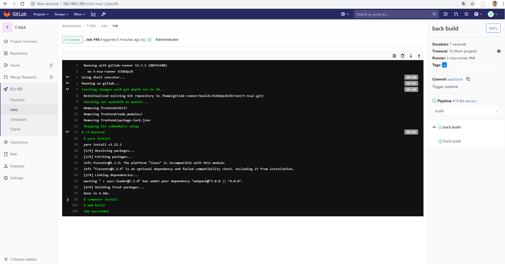
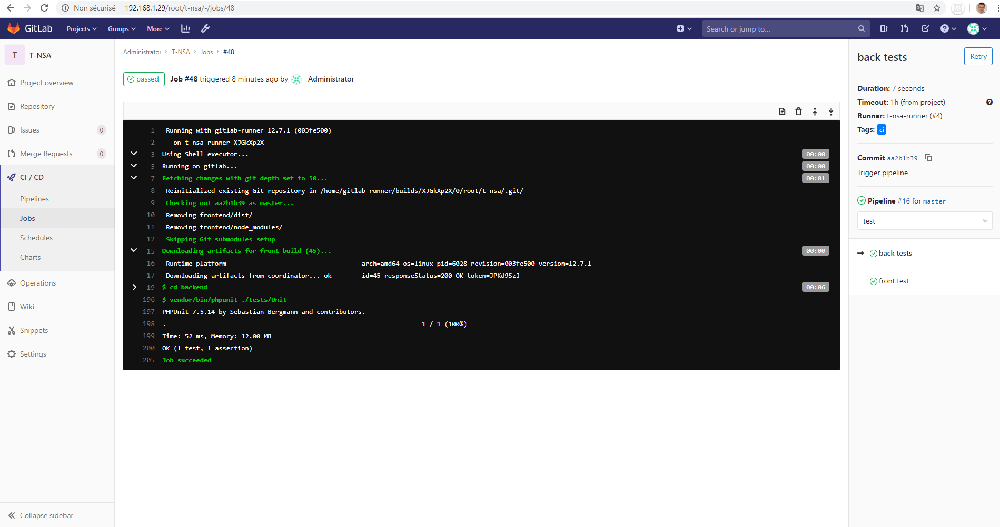
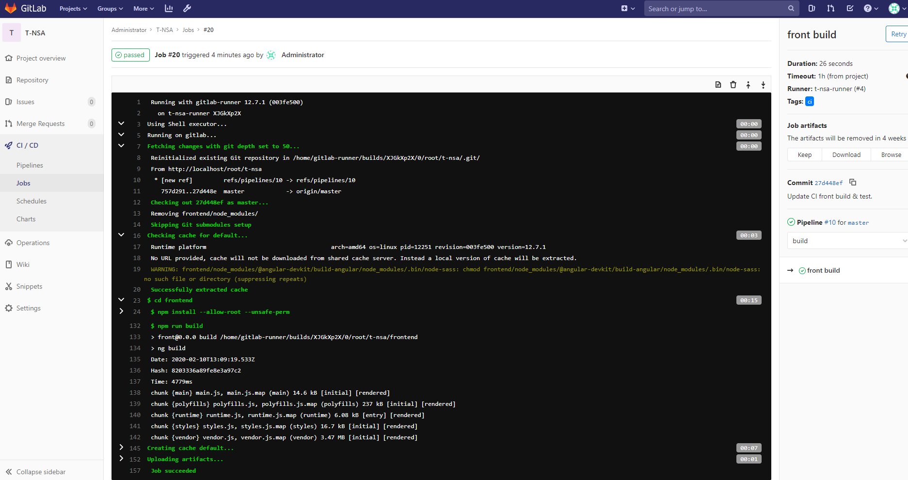

# T-NSA - Groupe 22

This repo contains the front and back end folders, as well as ansible plabooks and roles. 
We also include in this repo a terraform project that deploys 4 VMs on the Microsoft Azure cloud, give them a public IP address and gather them in a same network.

The Gitlab VM must be set manually, the other ones will be automatically configured with Ansible. You just have to setup the ssh access to them from the Gitlab VM so that ansible can connect to it.  

At the end of this readme, you can find some screenshots taken while setting up using ansible or building/testing/deploying using the Gitlab pipeline.


## Setup the VMs

```

    1 Install terraform on your computer

    2 Install the Azure CLI on your computer

    3 Create a subscription in Azure Cloud Services from Microsoft

    4 Change the subscription ID with yours in the main.tf file (line 34)

    5 Change the ssh key to add to the VM with yours in the main.tf file (line 10)

    6 Login to Azure using the azure CLI with: az login

    7 Apply the script with terraform

    8 Once done, your VMs are ready to be used
    
```

## Configure SSH access


```

    1 Login to the Gitlab VM (IP address can be find on the azure portal)

    2 Generate an ssh key
        ssh-keygen -t rsa -N "" -f /home/jonas/.ssh/id_rsa

    3 This point is to repeat on the 3 other VMs

        3.1 Login to the VM

        3.2 Generate an SSH key
            ssh-keygen -t rsa -N "" -f /home/jonas/.ssh/id_rsa

        3.3 Remove the part of the authorized_kesy file that avoid login as root (every thing until `ssh-rsa`)
            sudo nano /root/.ssh/authorized_keys

        3.3 Add permission to login as root using SSH, for this uncomment and change to have `PermitRootLogin yes` in /etc/ssh/sshd_config (can be find in the Authentication section of the file)
            sudo nano /etc/ssh/sshd_config

        3.4 Set root password explicitly (password to use: `Jonas1!`)
            sudo passwd root
            Jonas1! [Press Enter]
            Jonas1! [Press Enter]

        3.5 Reboot the VM
            sudo reboot
            
    4 Push the Gitlab SSH key to the other VMs by running following commands
        sudo ssh-copy-id -i /home/jonas/.ssh/id_rsa.pub root@<DB_VM_IP>
        sudo ssh-copy-id -i /home/jonas/.ssh/id_rsa.pub root@<FRONT_VM_IP>
        sudo ssh-copy-id -i /home/jonas/.ssh/id_rsa.pub root@<BACK_VM_IP>

```

## Prepare the Gilab VM


```

    1 Install docker
        sudo apt-get update
        sudo apt-get install docker.io

    2 Create script that starts gitlab container
        nano ~/startGitlab.sh

        With the following content:
        docker run --detach --hostname localhost --publish 443:443 --publish 80:80 --name gitlab --restart always --volume /srv/gitlab/config:/etc/gitlab --volume /srv/gitlab/logs:/var/log/gitlab --volume /srv/gitlab/data:/var/opt/gitlab gitlab/gitlab-ce:latest

    3 Start Gitlab server
        sudo chmod +x ./startGitlab.sh
        sudo sh startGitlab.sh

    4 Install gitlab runner locally
        curl -LJO https://gitlab-runner-downloads.s3.amazonaws.com/latest/deb/gitlab-runner_amd64.deb
        sudo dpkg -i gitlab-runner_amd64.deb
        gitlab-runner register --name t-nsa-runner --url http://<GITLAB_VM_IP> --registration-token z4GiP_5K6aBG-XhHp92H --tag-list ci --executor shell --non-interactive

    5 Push the Gitlab-Runner SSH key to the other VMs by running following commands
        ssh-keygen -t rsa -N "" -f /home/gitlab-runner/.ssh/id_rsa
        sudo ssh-copy-id -i /home/gitlab-runner/.ssh/id_rsa.pub root@<DB_VM_IP>
        sudo ssh-copy-id -i /home/gitlab-runner/.ssh/id_rsa.pub root@<FRONT_VM_IP>
        sudo ssh-copy-id -i /home/gitlab-runner/.ssh/id_rsa.pub root@<BACK_VM_IP>

    6 Install ansible
        sudo apt-add-repository ppa:ansible/ansible
        sudo apt-get update --fix-missing
        sudo apt-get install ansible -y

    7 Allow gitlab-runner to run ansible-playbook by adding following to /etc/sudoers
        gitlab-runner ALL=NOIPASSWD:/usr/bin/ansible-playbook

    8 Clone this repository

    9 Copy the content of the `setup/ansible` directory of this repo into /etc
        sudo cp -r t-nsa/setup/ansible /etc

    10 Setup the VMs
        sudo ansible-playbook /etc/ansible/install_and_setup_db.yml
        sudo ansible-playbook /etc/ansible/install_and_setup_front.yml
        sudo ansible-playbook /etc/ansible/install_and_setup_back.yml

    11 Connect to gitlab, create your project and register the gitlan-runner in the project settings > CI/CD
        sudo docker exec gitlab-runner gitlab-runner register --name t-nsa-runner --url http://<GITLAB_VM_IP> --registration-token wKYPkMDgwvnTWHhu1Mgz --tag-list ci --executor shell --non-interactive

    12 For development only, disable the firewall blocking the runner to access the repo:
        sudo ufw disable

```

##  Prepare environament for pipeline build and tests

```

    1 Install nodejs
        sudo curl -sL https://deb.nodesource.com/setup_13.x | sudo bash -
        sudp apt-get install -y nodejs

    2 Configure npm proxy
        npm config set proxy null
        npm config set https-proxy null
        npm config set registry http://registry.npmjs.org/


    3 Install angular
        sudo npm install -g @angular/cli

    4 Install chrome headless browser for front unit tests
        export CHROME_BIN=/usr/bin/google-chrome
        export DISPLAY=:99.0
        sudo apt-get update
        sudo apt --fix-broken install
        sudo apt-get install -y libappindicator1 fonts-liberation libasound2 libgconf-2-4 libnspr4 libxss1 libnss3 xdg-utils
        wget https://dl.google.com/linux/direct/google-chrome-stable_current_amd64.deb
        sudo dpkg -i google-chrome*.deb

    5 Install yarn
        sudo apt remove cmdtest
        sudo apt remove yarn
        curl -sS https://dl.yarnpkg.com/debian/pubkey.gpg | sudo apt-key add -
        echo "deb https://dl.yarnpkg.com/debian/ stable main" | sudo tee /etc/apt/sources.list.d/yarn.list
        sudo apt-get update
        sudo apt-get install yarn

    6 Install PHP
        sudo apt-get install openssl php-common php-curl php-json php-mbstring php-mysql php-xml php-zip # php7.3-common php7.3-fpm php7.3-bcmath php7.3-json php7.3-mbstring

    7 Install composer
        sudo apt install wget php-cli php-zip unzip
        php -r "copy('https://getcomposer.org/installer', 'composer-setup.php');"
        sudo php composer-setup.php --install-dir=/usr/local/bin --filename=composer

    8 Install phpunit
        sudo apt install phpunit

```

## Maintenance


If you need to restart the gitlab server or runner, run following commands:
```
sudo docker restart gitlab
sudo gitlab-runner restart
```


To test if the mysql server is listening, run following command on db VM:
```
sudo netstat -tulnp | grep mysql
```

## Screenshots

### Ansible

### Gitlab pipeline - CI/CD

#### Backend - install and build



#### Backend - unit tests



#### Frontend - install and build



#### Frontend - unit tests


#### Frontend - deployment


#### Frontend - deployment finished


