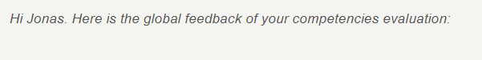

# DevOps - T-NSA-700

# Sommaire

- [DevOps - T-NSA-700](#devops---t-nsa-700)
- [Sommaire](#sommaire)
- [Presentation](#presentation)
- [Technologies](#technologies)
- [Environnement](#environnement)
  - [Dates](#dates)
  - [Temps à disposition](#temps-à-disposition)
  - [Projets en parallèle](#projets-en-parallèle)
- [Fonctionnalités](#fonctionnalités)
- [Equipe et répartition du travail](#equipe-et-répartition-du-travail)
  - [Membres assignés au backend et leur travail réalisé :](#membres-assignés-au-backend-et-leur-travail-réalisé-)
- [Notation](#notation)
- [Axes d'amélioration](#axes-damélioration)
- [Liens](#liens)

# Presentation

Automatisation du setup de VMs et du déployment du backend sur les VMs en utilisant des playbook Ansible et des pipelines GitLab.

# Technologies
* Ansible
* Terraform
* Pipelines

# Environnement
Semestre 7 *(premier semestre de M1)*

## Dates
* **Début :** 2019-10-14
* **Fin :** 2020-02-11

## Temps à disposition
**Nombre total de jours :** 29 (5,80 semaines; 1,45 mois)  
*Detail :*
* *Nombre de jours par semaine en cours : 2*
* *Nombre de semaines alternées : 15*
* *Nombre de semaines complètes en cours : 0*
* *Nombre de jours fériés : 1*

## Projets en parallèle 
* T-DIT-700 *(Transformation digitale - Proposer des solutions de digitalisation de process à une entreprise fictive)*
* T-BIZ-700 *(Workshop agile)*
* [T-PSP-700](https://github.com/HaberkornJonas/ManageMint_Frontend_T-ESP-900/tree/post_delivery/t-psp-700)
* [T-NSA-700](https://github.com/HaberkornJonas/DevOps_T-NSA-700)
* [T-WEB-700](https://github.com/HaberkornJonas/Count-Of-Money_T-WEB-700)

# Fonctionnalités
* Setup automatique de VMs avec Ansible
* Deployment automatique du code sur les VMs

# Equipe et répartition du travail
**Nombre de commit total :** 96 
**Chef de projet :** Haberkorn Jonas
**Documentation réalisée par :** Haberkorn Jonas  
**Diaporama de présentation réalisé par :** Haberkorn Jonas 

## Membres assignés au backend et leur travail réalisé :
* **Haberkorn Jonas**
  * Etudiant à : Strasbourg
  * Nombre de commits : 96
  * Tâches implémentées :  
    * Playbook Ansible
    * Pipeline GitLab
* **Audran David**
  * Etudiant à : Bordeaux
  * Nombre de commits : 0
  * Tâches implémentées : -
* **De Changy-Guyot Louis**
  * Etudiant à : Paris
  * Nombre de commits : 0
  * Tâches implémentées : -
* **Leveque Martin**
  * Etudiant à : Lyon
  * Nombre de commits : 0
  * Tâches implémentées : -

# Notation
**Référent pédagogique** : Heraud Baptiste (Strasbourg)
  
**Proportion des compétences validé :** 83%    

**Retour pédagogique :**   

Feedback  

# Axes d'amélioration
La plus part de ces axes d'amélioration n'ont pu être implémentés suite à un manque de temps pour le faire.  
* Lien entre front end et backend

# Liens
* [Projet](project)
* [Sujets](documents/subject)
